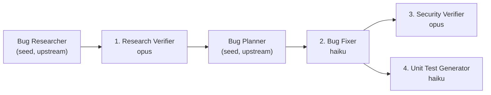

# 🤖 Homework 4 — MiniBank 4-Agent Pipeline

> **Student**: Dmitry Upatov
> **Course**: GenAI and Agentic AI for Software Engineering
> **AI tools used**: Claude Code (Claude Opus 4.8) as the orchestrating agent;
> the pipeline itself drives Claude Opus (verification/security) and Haiku (fixing/testing) per-agent.

A four-agent pipeline that **verifies bug research → fixes the bugs → security-reviews
the changes → generates and runs unit tests** against a small, intentionally-buggy
.NET sample app (**MiniBank**). The whole pipeline runs from **one command**.

---

## 🧭 Pipeline overview



**Run order**: Bug Researcher → **Research Verifier** → Bug Planner → **Bug Fixer**
→ **Security Verifier** (on changed code) → **Unit Test Generator** (on changed code).

The Bug Researcher and Bug Planner are **out of scope** for this homework, so their
outputs are committed as **seed context** (`context/bugs/001/`). The four required
agents consume and produce the rest.

---

## 🤝 The four agents & model choices

Each agent declares its model in its `*.agent.md` frontmatter. Models are chosen
**per task difficulty** — strong reasoning where mistakes are expensive, fast/cheap
where the work is mechanical:

| # | Agent | File | Model | Why this model |
|---|-------|------|-------|----------------|
| 1 | **Bug Research Verifier** | `agents/research-verifier.agent.md` | **opus** (`claude-opus-4-8`) | Verification is the pipeline's trust gate. A wrong root-cause judgement here corrupts every later step, so it gets the strongest reasoning model. |
| 2 | **Bug Fixer** | `agents/bug-fixer.agent.md` | **haiku** (`claude-haiku-4-5`) | The plan already contains exact before/after code. Applying it is deterministic, low-reasoning work — the cheapest fast model is the right tool. |
| 3 | **Security Verifier** | `agents/security-verifier.agent.md` | **opus** (`claude-opus-4-8`) | Security review is adversarial and high-impact; a missed or mis-rated vuln is costly. Strongest model. |
| 4 | **Unit Test Generator** | `agents/unit-test-generator.agent.md` | **haiku** (`claude-haiku-4-5`) | Test design *is* reasoning about equivalence classes and boundaries — but that reasoning now lives in the upgraded `unit-tests-FIRST` skill (explicit partitioning → boundary → error-path procedure). With the method made prescriptive, haiku executes it instead of inventing it, so the cheapest fast model suffices. |

### Skills (reusable rubrics the agents load)

| Skill | File | Used by |
|-------|------|---------|
| **Research Quality Measurement** | `skills/research-quality-measurement.md` | Research Verifier — D1–D5 rubric, L1–L4 quality levels, required output sections. |
| **Unit Tests — FIRST** | `skills/unit-tests-FIRST.md` | Unit Test Generator — Fast / Independent / Repeatable / Self-validating / Timely, **plus** an explicit test-design reasoning procedure (equivalence partitioning → boundary-value analysis → error paths) so a cheaper model still achieves full coverage. |

---

## 🐞 The sample app (MiniBank) and its seeded defects

A minimal C# / .NET 10 class library (`src/MiniBank`) + demo CLI (`src/MiniBank.Cli`).

| ID | Type | Where | Defect | Fix |
|----|------|-------|--------|-----|
| BUG-001 | Logic | `Bank.Withdraw` | No funds check → unbounded overdraft | Reject `amount > balance` (`Transfer` inherits guard) |
| BUG-002 | Logic | `InterestCalculator.CalculateSimpleInterest` | Missing `/365` → interest hugely inflated | Divide by `DaysPerYear` |
| SEC-001 | Security | `AuthService` | Hardcoded admin key + non-constant-time `==` | Key from env/config + `CryptographicOperations.FixedTimeEquals` |

**Before vs. after** (CLI output):

| | Before (buggy) | After (fixed) |
|--|----------------|---------------|
| Overdraft | `ACC-2 after -1000 withdraw: -970,00 ₴` | `Overdraft correctly rejected: Insufficient funds …` |
| Interest | `30-day simple interest @5%: 180,00 ₴` | `30-day simple interest @5%: 0,49 ₴` |
| Auth | secret in source | `Admin authenticated: True` (key from env) |

---

## 📦 Agent outputs (artifacts)

All under `context/bugs/001/`:

| Artifact | Produced by |
|----------|-------------|
| `research/verified-research.md` | Research Verifier (quality **L3 RELIABLE 8/10**, catches the seeded wrong root-cause) |
| `fix-summary.md` | Bug Fixer (3 changes, before/after, manual verification) |
| `security-report.md` | Security Verifier (SEC-001 resolved; only LOW/INFO residual) |
| `test-report.md` | Unit Test Generator (**18/18 passing**, FIRST self-check) |

Seed inputs (upstream, committed): `bug-context.md`, `research/codebase-research.md`,
`implementation-plan.md`.

---

## ▶️ Running it

See **[HOWTORUN.md](./HOWTORUN.md)** for full detail. Short version:

```bash
# Run the whole 4-agent pipeline (one command):
./run-pipeline.sh            # Linux/macOS/Git-Bash
pwsh ./run-pipeline.ps1      # Windows PowerShell 7+

# Or just run the app / tests directly:
export MINIBANK_ADMIN_API_KEY="super-secret-admin-key-12345"
dotnet run --project src/MiniBank.Cli
dotnet test
```

---

## 🛠️ How AI was used

- **Claude Code (Opus 4.8)** scaffolded the app, authored the agents/skills, and
  executed each pipeline stage to produce the committed artifacts.
- The pipeline is designed to re-run headless: `run-pipeline.sh` invokes `claude -p`
  for each agent with the model from its frontmatter and auto-loads its skills.
- Everything AI produced was **verified by building and running** the app and the
  test suite (`dotnet test` → 18/18 green) — not just accepted as text.

## 📁 Structure

```
homework-4/
├── README.md / HOWTORUN.md
├── run-pipeline.sh / run-pipeline.ps1      # single-command orchestrator
├── MiniBank.slnx
├── agents/        research-verifier · bug-fixer · security-verifier · unit-test-generator (.agent.md)
├── skills/        research-quality-measurement.md · unit-tests-FIRST.md
├── context/bugs/001/   bug-context · research/{codebase-research,verified-research} · implementation-plan · fix-summary · security-report · test-report
├── src/           MiniBank (lib) · MiniBank.Cli (demo)
├── tests/         MiniBank.Tests (xUnit)
└── docs/screenshots/
```
